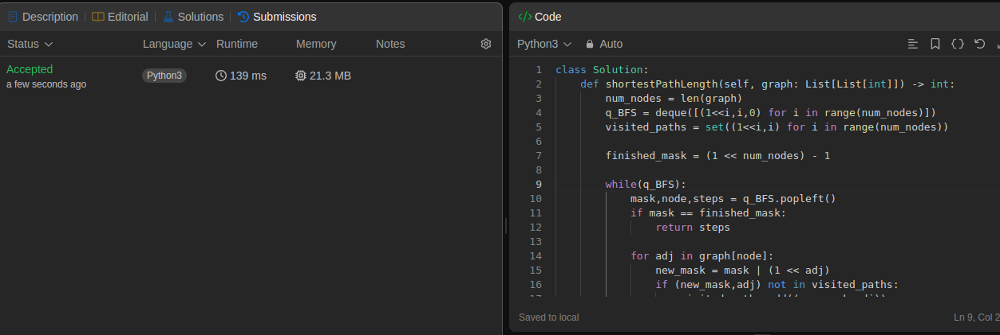
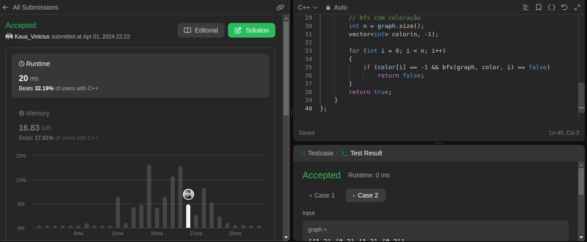
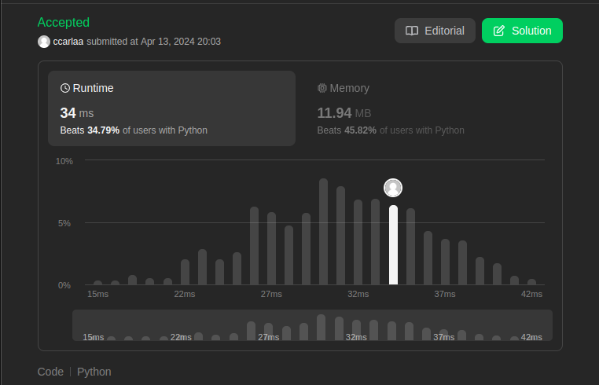
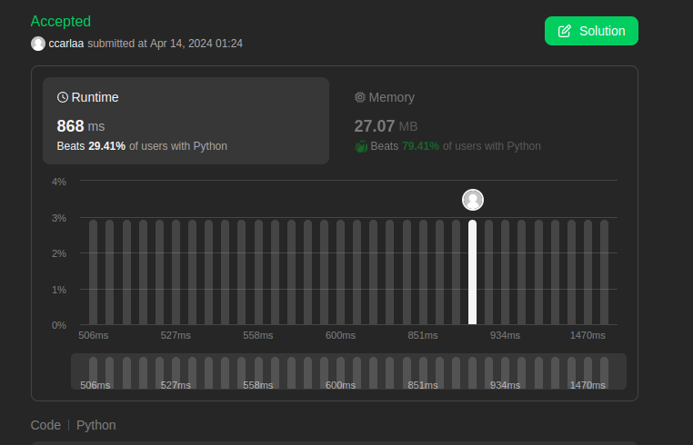

# Grafos 1 Juiz Virtual

**Número da Lista**: 1<br>
**Conteúdo da Disciplina**: Grafos 1<br>

## Alunos
|Matrícula | Aluno |
| -- | -- |
| 21/1029399  | Kauã Vinícius  |
| 18/0030736  |  Carla de Araújo |

## Sobre 
Este repositório tem como objetivo a realização de exercícios de grafos do site [leetcode](https://leetcode.com/), seguem os exercícios solucionados com seus respectivos vídeos:

1 - [Shortest Path Visiting All Nodes](https://leetcode.com/problems/shortest-path-visiting-all-nodes/description/): Hard. [Vídeo](https://youtu.be/IVSBzCf2gkQ)
</br>
2 - [Is graph Bipartite](https://leetcode.com/problems/is-graph-bipartite/description/): Medium. [Vídeo](https://youtu.be/VP7QSoFTaUo)
</br>
3 -
</br>
4 - 

## Screenshots
As imagens 1 à 4 evidenciam as screenshots dos códigos que foram aceitos pelo site:

##### 1 - Shortest Path Visiting All Nodes


<div style="text-align: center">
<p> Imagem 1: Código aceito primeiro exercício (Fonte: Autor, 2024).</p>
</div>

##### 2 - Is Graph Bipartite


<div style="text-align: center">
<p> Imagem 2: Código aceito segundo exercício (Fonte: Autor, 2024).</p>
</div>

##### 3 - Clone Graph


<div style="text-align: center">
<p> Imagem 2: Código aceito segundo exercício (Fonte: Autor, 2024).</p>
</div>

##### 4 - All Ancestors of a Node in a Directed Acyclic Graph


<div style="text-align: center">
<p> Imagem 2: Código aceito segundo exercício (Fonte: Autor, 2024).</p>
</div>

## Instalação 
**Linguagem**: C++ e Python<br>

Para os códigos python, execute:

```
python <nome do arquivo>
```

Para os códigos em c++, execute:

```
g++ -o <nomedoarquivo>.exe ./<nomedoarquivo>.cpp
```


